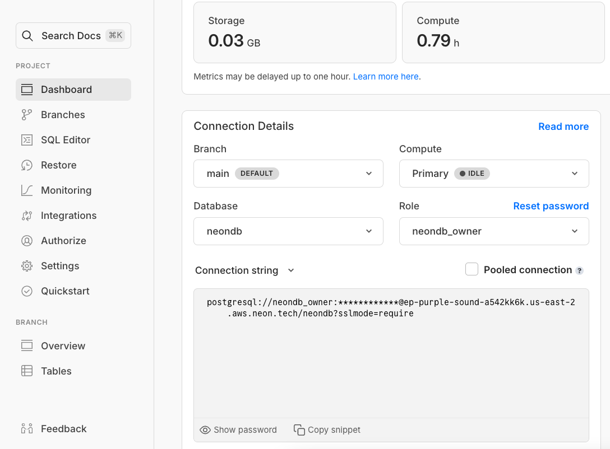
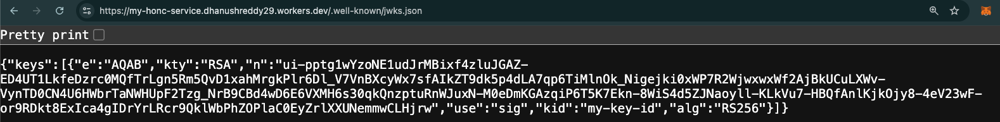
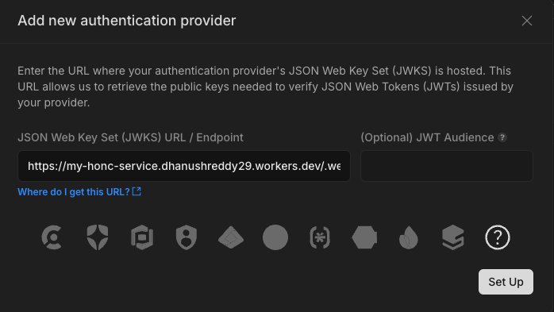
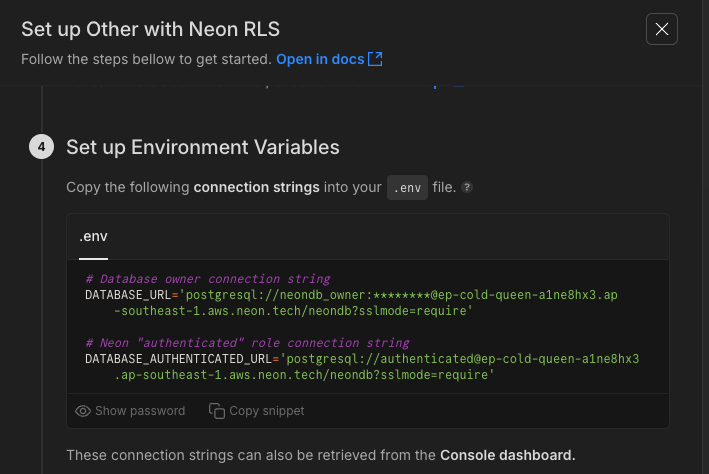

<picture>
  <source media="(prefers-color-scheme: dark)" srcset="https://neon.com/brand/neon-logo-dark-color.svg">
  <source media="(prefers-color-scheme: light)" srcset="https://neon.com/brand/neon-logo-light-color.svg">
  
</picture>

# Neon RLS Demo: Securing Your Application with Custom JWTs and Row-Level Security

This project demonstrates how to leverage **Neon RLS** using Custom JWT's. Instead of relying on JWTs generated by third-party authentication providers (like Clerk or Auth0), this demo showcases how to create and use JWTs signed directly by your server.

### **Why is this important?**

Neon RLS lets you move authorization logic closer to your data in PostgreSQL. By using custom JWTs, you maintain complete control over the token generation process while still benefiting from integration with RLS. This approach is valuable when you have specific requirements for your JWT structure or want to avoid dependencies on external auth providers for certain internal workflows.

This demo is built as a [HONC](https://honc.dev/) API and exposes the following endpoints to illustrate these concepts:

- `/token` — Generates and returns a custom JWT signed by the server. This token contains claims that will be used by PostgreSQL to enforce RLS. The token includes a `tenant_id` claim that determines the data access rights in this example.
- `/.well-known/jwks.json` — Serves the JSON Web Key Set (JWKS) containing the public key. Neon RLS uses this to verify the signature of the custom JWTs you provide.
- `/api/users` — Retrieves a list of users. Access to individual user records is controlled by RLS based on the `sub` claim in the JWT.
- `/api/tenants` — Retrieves a list of tenants. Access to tenant records is also controlled by RLS based on the `tenant_id` claim in the JWT.

The database schema is defined using [Drizzle ORM](https://orm.drizzle.team/) and can be found in `src/db/schema.ts`. The generated SQL migrations are located in the `drizzle/` directory. A `seed.sql` file is included to populate the database with initial demo data.

## Prerequisites

Before you begin, ensure you have the following installed:

- [Bun](https://bun.sh/) (or Node.js with npm/yarn/pnpm)
- [Wrangler](https://developers.cloudflare.com/workers/wrangler/install-and-update/) (for deploying to Cloudflare Workers)
- A [Neon](https://neon.tech/) account and project

## Getting Started

Follow these steps to run the demo:

1. Install the dependencies:

   ```bash
   bun install
   ```

2. **Generate Key Pair:** Generate the public and private keys used for signing the JWTs. Run the following command:

   ```bash
   bun generate-keys.ts
   ```

   This will create `publicKey.jwk.json` and `privateKey.jwk.json` files containing the respective keys in JWK format.

3. **Set Up Neon Project:**

   - Create a new project in your Neon account.
   - Copy the connection string from Neon Console.
     

4. **Configure `wrangler.toml`:** Create your `wrangler.toml` file with the following configuration. **Replace the placeholder values** with your actual Neon connection strings and the content of your generated key files:

   ```toml
   name = "my-honc-service"
   compatibility_date = "2024-07-25"
   compatibility_flags = [ "nodejs_compat" ]

   [vars]
   # neondb_owner role - used for migrations and seeding, which you copied from Neon Console
   DATABASE_URL = "postgres://<user>:<password>@<host>:<port>/<database>?sslmode=require"
   # authenticated, passwordless role (you can keep this empty for now)
   DATABASE_AUTHENTICATED_URL = ""
   # Contents of publicKey.jwk.json
   PUBLIC_KEY='{"kty":"RSA", ... }'
   # Contents of privateKey.jwk.json
   PRIVATE_KEY='{"kty":"RSA", ... }'
   ```

   **Important:** Make sure to copy the _content_ of the JWK files into the `PUBLIC_KEY` and `PRIVATE_KEY` variables as strings.

5. **Deploy to Cloudflare Workers:** Deploy the demo application:

   ```bash
   bun run deploy
   ```

6. **Verify Public Key Endpoint:** After deployment, verify that the public key is being served correctly by visiting the JWKS endpoint in your browser. Replace `<your-name>` with your Cloudflare Workers subdomain:

   ```
   https://my-honc-service.<your-name>.workers.dev/.well-known/jwks.json
   ```

   

   You should see the contents of your `publicKey.jwk.json` file.

7. **Configure Neon RLS:**

   - Go to the **RLS** page in your Neon console (project > settings).
   - Add a new authentication provider.
   - Set the **JWKS URL** to the URL you verified in the previous step (e.g., `https://my-honc-service.<your-name>.workers.dev/.well-known/jwks.json`).
      
      
   
   - Follow the steps in the UI to setup the roles for Neon RLS. You should ignore the schema related steps if you're following this guide
   - Note down the connection strings for both the **`neondb_owner` role** and the **`authenticated, passwordless` role**. You'll need both. The `neondb_owner` role has full privileges and is used for migrations, while the `authenticated` role will be used by the application and will have its access restricted by RLS.
   
      

8. **Apply Database Migrations:**

   - Create a `.dev.vars` file in the project root and populate it with your Neon database URLs:

     ```bash
     cp .dev.vars.example .dev.vars
     ```

     Update the `.dev.vars` file with the connection strings you noted down from Neon RLS:

     ```env
     DATABASE_AUTHENTICATED_URL="postgres://<user>.<role>:<password>@<host>:<port>/<database>?sslmode=require" # authenticated role
     DATABASE_URL="postgres://<user>:<password>@<host>:<port>/<database>?sslmode=require" # neondb_owner role
     ```

   - Apply the database migrations using the `neondb_owner` role:

     ```bash
     bun run db:migrate
     ```

9. **Seed the Database:** Seed the database with initial data using the `neondb_owner` role:

   ```bash
   bun run db:seed
   ```

10. **Update `wrangler.toml`** Ensure that the `DATABASE_AUTHENTICATED_URL` in your `wrangler.toml` file is set to the connection string for the **`authenticated` role**.

11. **Redeploy:** Deploy the application again to ensure the correct `DATABASE_AUTHENTICATED_URL` for the authenticated role is used:

    ```bash
    bun run deploy
    ```

12. **Verify API Endpoints:** Access the API endpoints in your browser to verify that the RLS is working as expected.

    - **Users Endpoint:** Visiting this endpoint will use a custom JWT with a specific `tenant_id`. You should only see users associated with that tenant.

      ```
      https://my-honc-service.<your-name>.workers.dev/api/users
      ```

    - **Tenants Endpoint:** Similarly, this endpoint's access will be filtered based on the `tenant_id` in the JWT.

      ```
      https://my-honc-service.<your-name>.workers.dev/api/tenants
      ```

## Understanding the Code

- **`generate-keys.ts`:** This script generates the RSA key pair used for signing and verifying JWTs.
- **`src/index.ts`:** This is the main application logic. It defines the API endpoints, generates custom JWTs, and interacts with the Neon database using Drizzle ORM. Notice how the `authToken` is included when creating the Drizzle client, allowing Neon RLS to enforce RLS based on the JWT claims.
- **`src/db/schema.ts`:** Defines the database schema using Drizzle ORM, including the Row-Level Security policies that restrict access based on the `auth.session()->>'tenant_id'` and `auth.user_id()` values derived from the JWT.
- **`seed.sql` & `seed.ts`:** These files contain the initial data and the script to seed the database. Pay attention to the `GRANT` statement in `seed.sql`, which grants permissions to the `authenticated` role, the role under which RLS policies are enforced.

## Key Concepts Demonstrated

- **Custom JWT Generation:** The demo showcases how to create and sign JWTs directly within your application, giving you full control over the claims included.
- **Neon RLS Integration:** The project demonstrates how to configure Neon RLS to trust your custom JWTs by providing the JWKS URL.
- **Row-Level Security (RLS):** The database schema includes RLS policies that use the `auth.session()` and `auth.user_id()` functions (provided by the `pg_session_jwt` extension, which Neon RLS leverages) to enforce access control based on the claims in the JWT.
- **Multi-Tenancy:** The example demonstrates a basic multi-tenant scenario where users and data are associated with specific tenants, and access is restricted accordingly.

## Next Steps and Further Exploration

- **Explore Different JWT Claims:** Experiment with adding more custom claims to your JWTs and create corresponding RLS policies to enforce different access control rules. Currently the JWT uses hardcoded `tenant_id` and `sub` claims, but you will likely want to use dynamic values based on the authenticated user.
- **Implement User Authentication:** Integrate a proper authentication mechanism to issue these custom JWTs to authenticated users.

## Learn More

- [Neon RLS Tutorial](https://neon.tech/docs/guides/neon-rls-tutorial)
- [Simplify RLS with Drizzle](https://neon.tech/docs/guides/neon-rls-drizzle)

## Authors

- [David Gomes](https://github.com/davidgomes)

## Contributing

Contributions are welcome! Please feel free to submit a Pull Request.
